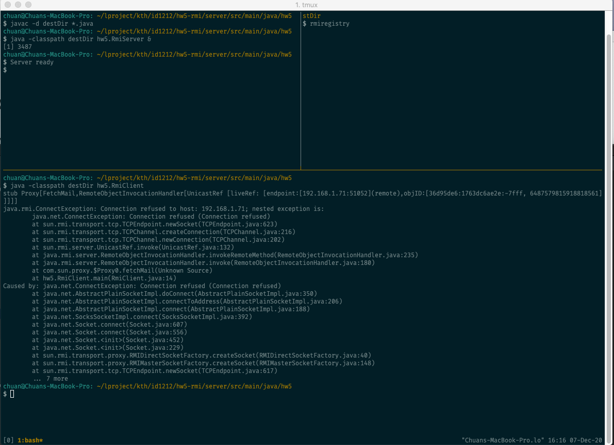

## Up and running

#### Start rmiregistry

```bash
mvn clean install
cd target/classes

rmiregistry
```
### Start RMI Server
Use Intellij to run the main class `hw5.RmiServer` for now.

### Run RMI Client

```bash
mvn exec:java -Dexec.mainClass="hw5.RmiClient"
```



